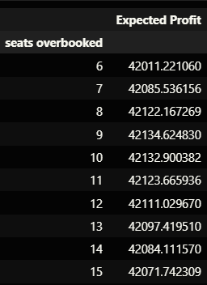

# Airline-Dynamic-Pricing

## EXECUTIVE SUMMARY
Maximizing revenue and optimizing operational efficiency are critical objectives for airline
companies. Achieving these goals requires strategic pricing of tickets and effective
management of overbooking scenarios to maximize passenger bookings and overall
profitability. This involves developing and implementing dynamic pricing policies for coach
and first-class seats, with prices adjusted daily based on various factors such as demand
and overbooking limits.

In this analysis, we explore two key strategies for determining ticket prices. The first
strategy involves setting a predetermined threshold for permissible overbooking and
continuing ticket sales until the flight date or ticket availability is depleted. The second
strategy allows the airline to adjust ticket sales dynamically to optimize overbooking
opportunities and maximize revenue potential.

Both approaches are addressed using advanced dynamic programming techniques to
determine the optimal ticket prices for each class on any given day. By leveraging
sophisticated modeling and analytical tools, our company can make data-driven decisions
to maximize expected profit while balancing passenger demand and operational
considerations.

Ultimately, the chosen strategy will depend on factors such as overbooking constraints,
revenue objectives, and market dynamics. By adopting dynamic pricing policies informed
by comprehensive analysis, airlines can enhance revenue generation, improve
operational efficiency, and maintain competitiveness in the aviation industry.
Some of the key questions that we aim to address through our analysis are:

1. How often is the coach overbooked?
2. How often are passengers kicked off the plane?
3. What is the average overbooking cost?
4. What is the volatility of discounted profits?

## PROBLEM DESCRIPTION
Our airline company is planning to operate a flight scheduled for departure one year from
now, with two distinct seating classes: first class and coach. Sales of tickets for each class
are independent, meaning that demand for one class does not affect the other. However,
if all first-class tickets are sold out, the probability of a customer purchasing a coach ticket
increases by 3%, regardless of the price.

We have a policy of not overbooking first-class tickets, but we do overbook coach tickets.
In case more coach customers show up for the flight than there are available coach seats,
we face two potential costs. Firstly, if there are vacant first-class seats due to unsold
tickets or absent customers, we can upgrade coach customers to first-class for a cost of
$50 per customer. Secondly, if upgrading is not feasible, either because first-class is fully
booked or after exhausting available upgrades, we must offer vouchers at a cost of $425
per remaining overbooked customer.

We have additional details regarding the likelihood of customers showing up for their
flights: coach customers have a 95% chance of showing up, while first-class customers
have a 97% chance. Our aircraft has a capacity of 100 seats in coach and 20 seats in
first-class.

For coach seats, we offer two price options: $300 or $350. The probability of a customer
purchasing a coach ticket is 65% at the low price and 30% at the high price. When firstclass tickets are sold out, these probabilities increase to 68% and 33%, respectively.

#### Parameter Initialization

#### Approach 
We aim to determine the optimal pricing strategy for both first-class and coach tickets in
the lead-up to the flight departure date. This involves making decisions on setting prices
for first-class and coach tickets each day leading up to the flight. There are four possible
pricing decisions:

1. Low price Coach, Low price First
2. High price Coach, Low price First
3. Low price Coach, High price First
4. High price Coach, High price First

Each decision is associated with nine different scenarios for each day leading up to the
flight:

1. Sold Low Coach, Sold Low First
2. Sold High Coach, Sold Low First
3. Sold Low Coach, Sold High First
4. Sold High Coach, Sold High First
5. Not Sold Coach, Sold Low First
6. Not Sold Coach, Sold High First
7. Sold Low Coach, Not Sold First
8. Sold High Coach, Not Sold First
9. Not Sold Coach, Not Sold First
    
We will explore two strategies to determine the optimal pricing policy. The first strategy
involves setting a fixed number of allowed overbooked tickets (5 to 15 tickets) and
selecting the policy that maximizes expected profits.

The second strategy employs dynamic programming to optimize the number of
overbooked tickets based on expected costs and allows for the option to stop selling
tickets to maximize profits. In this strategy, there is a soft cap of 20 tickets overbooked.
Additionally, a new decision action of not selling coach tickets on a specific day is
introduced.

Despite the addition of the option to not sell coach tickets, the nine daily situations remain
the same, with the inclusion of "Not Sold Coach" states to represent this decision.

# STRATEGY 1 FORMULATION
#### State Variables
The state variables would be number of coach seats sold, time, and number of first-class
seats sold. In this case, we can represent this as
(c, t, f)

#### Choice Variables
The choice variables would be as explained above as decisions. In this case, we
represent this as

1. coach price low, first price low
2. coach price high, first price low
3. coach price low, first price low
4. coach price high, first price high
   
#### Dynamics

In order to change from one state to another, we would need to find the number of tickets
sold to today and the number of tickets sold already for both coach and first-class. Time
will always increase from one state to another. The possible next states can be
represented as:

1. (c, t+1, f) - unsold coach and first-class ticket today
2. (c+1, t+1, f) - sold coach ticket, but not first-class ticket today
3. (c+1, t+1, f+1) - sold both coach and first-class ticket
4. (c, t+1, f+1) - sold first-class ticket, but not coach

#### Value Function

#### Bellman Equation/Expected Revenue

Given the possible choices (HcHf, HcLf,LcHf,LcLf), we can rewrite the above
equation as follows to get the expected revenue:

In each of the 4 possible scenarios above, the expected revenue today will be given as
follows:

Expected future revenue in each of the four scenario would be as follows:

In the above equation, 𝑆𝑐 denotes sale in coach class and 𝑆𝑓 denotes sale in first class.
𝑆𝑐 and 𝑆𝑓 denotes no sale in coach and first class respectively. 𝑝𝑟𝑜𝑏( ) function denotes
the probability of sale in each scenario. The expected future revenue when discounted
and added to ‘expected revenue today’ gives the total expected revenue.

#### Terminal Condition

On day T= 365, no more tickets can be sold, but overbooking costs can be incurred.

#### Overbooking Costs

There are two types of overbooking costs incurred:

● If there are vacant first-class seats due to unsold tickets or absent customers, we
can upgrade coach customers to first-class for a cost of $50 per customer.

● If upgrading is not feasible and the customer needs to be bumped off the plane,
we must offer vouchers at a cost of $425 per remaining overbooked customer.

##### Profit Calculation in different scenarios:

a. Scenario 1 (Flight Full)

b. Scenario 2 ( First class full but Coach not full)

In the scenario where the first class is already full but the coach class is not, we have two
possible price points to charge for coach class: $300 and $350. Additionally, the
probability of purchase here goes up by 3%. 

c. Scenario 3 (First Class not full but Coach full)

In the scenario where there are no seats available in the coach class but are available in
first class, we can charge two possible prices in the first class (low/high) at $425 and $500
respectively.

d. Scenario 4 (Both not full)

In case, we have seats available in both the classes, prices in any of the 4 possible
combinations can be charged as stated in the choice variables.

For strategy 1, we initially ran for the case where we are allowed to overbook coach class
by 5 seats. The expected profit for this policy is obtained to be **$41886.158**

Based on the Bellman equation, we can calculate the profit value for each of the
overbooking values (ranging from 5 to 15 seats) to find the optimal overbooking policy
which leads to the highest return in terms of profit. The results are shown in the plot below.

We observe that the highest profit is obtained when 9 seats are allowed to be overbooked
in the coach class. In value terms, the expected profit in this scenario is $42134.624
The table below provides the maximum discounted profit for different overbookings: 

# STRATEGY 2 FORMULATION
In strategy 2, instead of a hard cap of tickets that we can overbook, we would allow the
dynamic programming algorithm to find where to stop selling tickets to reduce costs while
maximizing profits. This would introduce another decision to stop selling coach tickets at
any given state. This would be similar to assuming that coach tickets are sold out as seen
in strategy 1. Therefore, there are only a few slight changes between strategy 1 and
strategy 2.

#### State Variables

The state variables would be the same as Strategy 1
(c, t, f)

#### Choice Variables

There would be an addition of 2 decision variables from Strategy 1:

1. coach price low, first price low
2. coach price high, first price low
3. coach price low, first price low
4. coach price high, first price high
5. don’t sell coach, first low
6. don’t sell coach, first high

#### Dynamics

The dynamics would be similar as an unsold coach ticket could also be considered that
the ticket was never put up on sale in the first place as a decision.

5. (c, t+1, f) - unsold coach and first-class ticket today
6. (c-1, t+1, f) - sold coach ticket, but not first-class ticket today
7. (c-1, t+1, f-1) - sold both coach and first-class ticket
8. (c, t+1, f-1) - sold first-class ticket, but not coach
   
#### Value Function

#### Bellman Equation

The Bellman equation for most parts remain the same as strategy 1 but except
would the 2 cases which are captured by “val5” and “val6” variables in the code
snippet below:

● when the coach is not and first-class is offered low price

● when the coach is not and first-class is offered high price 

Based on the Bellman equation, we can calculate the profit value for each of the
overbooking values (ranging from 5 to 20 seats) to find the optimal overbooking policy
which leads to the highest return in terms of profit. The results are shown in the plot below.

Here we can observe that the maximum expected discounted profit is when we allow
coach to be oversold by 11 seats since after 11 the change in profit is not so significant
and we can avoid increasing more seats to be oversold

# COMPARISON OF STRATEGIES

To compare the outcomes of both strategies, 10,000 simulations were performed
and performance metrics like overbooking cost, price volatility, etc. were evaluated.
Each simulation involved sampling out from the probability distribution for a
passenger buying a ticket for a day given the prices for both classes. The
simulations also sampled for number of passengers showing up on the day of the
flight from binomial distribution given the number of tickets sold, based on the
optimal pricing policy obtained through dynamic programming.

The next step was to compare the effectiveness of both the strategies:

1. First we compared the expected profit distribution for both strategies

Inference: we can see from the two charts that although they look similar they
differ at the distribution of the tails with more observations for strategy 1 of profit
between 38-40k compared that of strategy 2

2. Next, we compare the overbooking costs for both the strategies.

As you can see, coach overbooking occurred in each scenario for each strategy clearly
implying the revenue from overbooking far outweighs the cost associated with it even with
diminishing returns. 

3. Finally the number of times passengers were bumped off of the plane given the
number of simulations.

Inference: Based on the charts we can see that given 100000 simulations, for
strategy 1 overall we will bump 70% of the time vs strategy 2 where we bump
passengers 71.3% of the time. 

4. Overbooking cost distribution

Inference: From the chart, the overbooking costs frequency is approximately the
same for each overbooking cost implying that regardless of strategy the distribution will
remain the same. 

# CONCLUSION

Although we see that the overall expected profit is slightly higher in the case of the
No Sale Flexibility strategy, the overbooking cost, kickoff rates and the transfer
rates are better than in the Optimal Overbooking strategy. Thus, from the customer
retention standpoint, given that the overall profitability is quite similar and there is
no statistically significant difference, our recommendation is to go with the
Optimal Overbooking strategy since their kickoff rates and transfer rates are
lower thereby providing a better customer experience.

